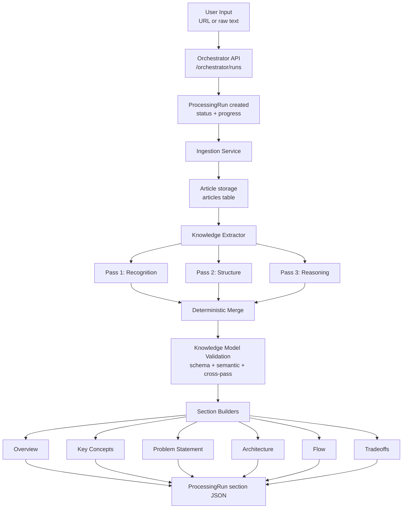

# Mental Model Generator

## Project Overview

Mental Model Generator is a FastAPI-based backend that turns long-form engineering articles into a structured six-section mental model. During the current MVP phase, write access is kept private by network placement: the backend binds to loopback in production, API docs stay disabled outside development, and only previously generated outputs are exposed through the history endpoint.

The current implementation is built around an orchestration pipeline that:

1. ingests the source article,
2. cleans and normalizes the text,
3. extracts a typed intermediate knowledge model through multiple LLM passes,
4. validates and repairs cross-pass consistency,
5. renders the final six mental-model sections as structured JSON.

Those six sections are:

1. `overview`
2. `key_concepts`
3. `problem_statement`
4. `architecture`
5. `flow`
6. `tradeoffs`

This design separates extraction from presentation. The system first builds a reusable knowledge representation of the article, then uses that representation to generate reader-facing sections with consistent structure and cross-links.

## Problem It Solves

Engineering articles often explain sophisticated systems, design choices, and tradeoffs in a narrative format that is hard to parse quickly. Readers usually need to manually reconstruct:

1. what system the article is about,
2. what problem it is solving,
3. what concepts matter,
4. how the architecture fits together,
5. how the system behaves end to end,
6. what tradeoffs shaped the design.

This project addresses that gap by converting an article into a structured mental model instead of a plain summary. The goal is not only to compress the article, but to surface the article's system boundaries, entities, relationships, flows, and tradeoffs in a format that can support richer downstream UI experiences.

## Detailed Architecture

The current backend architecture follows a staged orchestration pattern with persistent state at each major layer.

### 1. API and orchestration layer

The application starts in [main.py](D:/Tech_With_Me/portfolio/resume/Mental-Model-Generator/main.py), which mounts three route groups:

1. `/orchestrator`
2. `/validator`
3. `/storage`

The main execution path lives in [app/modules/orchestrator/service.py](D:/Tech_With_Me/portfolio/resume/Mental-Model-Generator/app/modules/orchestrator/service.py). A request to create a run:

1. validates that exactly one input is provided: `source_url` or `raw_text`,
2. creates a `ProcessingRun` record with `queued` status,
3. launches the pipeline asynchronously with FastAPI `BackgroundTasks`,
4. keeps run creation and polling private through deployment topology rather than an application-layer admin key,
5. updates run progress and step names throughout execution,
6. stores each generated section directly on the run record.

The orchestrator pipeline is explicitly step-based:

1. `ingestion`
2. `multi_pass_extraction`
3. `merge_validation`
4. `overview`
5. `key_concepts`
6. `problem_statement`
7. `architecture`
8. `flow`
9. `tradeoffs`

Each step is retried independently with exponential backoff. Failures update the run status to `failed` and preserve only a sanitized client-safe error message in storage while full details remain in server logs.

### 2. Ingestion layer

The ingestion boundary is implemented in [app/modules/ingestion/services/ingestion_service.py](D:/Tech_With_Me/portfolio/resume/Mental-Model-Generator/app/modules/ingestion/services/ingestion_service.py). It chooses one of two flows:

1. `RawTextIngestionService` for direct article text
2. `UrlIngestionService` for source URLs

For URL-based ingestion, the system:

1. uses Firecrawl to scrape the page as markdown,
2. keeps only main content,
3. removes ads and base64 images,
4. captures optional metadata such as title, media, and warnings,
5. passes the markdown through `DocumentCleaningService`.

The cleaning stage strips remaining HTML, cookie banners, boilerplate headings, low-value lines, and excessive whitespace. The output is persisted as an `Article` record containing:

1. raw text,
2. cleaned text,
3. title and domain,
4. word count,
5. scrape timing and extraction metadata.

URL ingestion is idempotent at the article layer: if the same `source_url` already exists, the existing article is reused.

### 3. Knowledge extraction layer

The core extraction engine is [app/modules/extractor/services/extractor_service.py](D:/Tech_With_Me/portfolio/resume/Mental-Model-Generator/app/modules/extractor/services/extractor_service.py). It transforms cleaned article text into a typed `KnowledgeModelRecord`.

This stage runs three specialized passes in parallel with `ThreadPoolExecutor`:

1. `recognition`
   Identifies article summary, core problem, named entities, concept definitions, key quotes, and scale/problem signals.
2. `structure`
   Extracts relationships, flow sequences, architectural layers, and temporal signals.
3. `reasoning`
   Extracts tradeoff signals and constraints.

Each pass is executed through a shared `PassExtractor`, which:

1. calls the LLM through a provider-agnostic `LLMClient`,
2. parses responses into strict Pydantic models,
3. computes a structural confidence score,
4. combines that with the model's self-reported confidence,
5. retries low-confidence outputs,
6. falls back to the best available result if retries are exhausted.

This makes extraction resilient without forcing the whole pipeline to fail on every weak response.

### 4. Merge and validation layer

After the three extraction passes finish, `MergeService` deterministically assembles them into a single `KnowledgeModel`.

The merge layer does more than simple concatenation:

1. backfills entities referenced by the structure pass but missed by recognition,
2. canonicalizes duplicate entities and merges aliases,
3. generates deterministic IDs for entities, concepts, relationships, flows, and tradeoffs,
4. remaps references to canonical entity names,
5. computes the final confidence score using the weakest-link rule.

Validation is handled by `KnowledgeModelValidator` in two phases:

1. schema and semantic validation
2. cross-pass referential validation

The validator checks uniqueness, entity references, flow consistency, layer quality, stable IDs, evidence coverage, and other structural guarantees. If cross-pass validation fails because structure references unknown entities, the extractor retries the structure pass once and re-merges the result. If issues still remain, the system preserves them as warnings instead of discarding the run.

This architecture creates a clear intermediate representation before section generation, which is one of the strongest design decisions in the current codebase.

### 5. Section generation layer

Once the knowledge model is validated, the orchestrator runs six section builders sequentially. Each builder consumes the same intermediate model plus the stored article record.

The builders use a hybrid pattern:

1. deterministic extraction for structure and cross-linking,
2. optional LLM enrichment for narrative fields,
3. deterministic fallback if enrichment fails.

Current section responsibilities are:

1. `OverviewSectionBuilder`
   Produces the one-line summary, system name, company, domain tags, full summary, and why-it-exists framing.
2. `KeyConceptsBuilder`
   Ranks load-bearing concepts, filters generic ones, and enriches concept definitions and importance.
3. `ProblemStatementBuilder`
   Builds the core problem narrative, categorized problem signals, urgency, and architecture-linked affected entities.
4. `ArchitectureBuilder`
   Produces graph-ready nodes, edges, layers, key relationships, and architecture narrative.
5. `FlowBuilder`
   Produces walkthroughs with stable step IDs, transitions, node references, interaction types, and flow-level narrative.
6. `TradeoffsBuilder`
   Produces tradeoffs, constraints, takeaways, evidence, and entity links.

Several builders explicitly preserve cross-section linkage by resolving entity names into stable node slugs. That means the output is already shaped for a UI that wants coordinated highlighting between architecture, flows, problems, and tradeoffs.

### 6. Persistence model

The storage schema in [app/storage/models.py](D:/Tech_With_Me/portfolio/resume/Mental-Model-Generator/app/storage/models.py) is organized around three persistent records:

1. `Article`
   Stores the ingested article and cleaned text.
2. `KnowledgeModelRecord`
   Stores the merged knowledge model and raw JSON from all three extraction passes.
3. `ProcessingRun`
   Stores orchestration status, progress, and the six final section JSON blobs.

This creates a layered persistence strategy:

1. source document state,
2. intermediate semantic representation,
3. final presentation-oriented outputs.

## End-to-End Flow

The currently implemented end-to-end execution path is:

1. An operator submits `POST /orchestrator/runs` with either `source_url` or `raw_text`.
2. The API creates a queued `ProcessingRun` and returns immediately with a `202` response.
3. A background task starts the orchestrator pipeline.
4. The pipeline ingests the article and stores an `Article` record.
5. The extractor reads `cleaned_text` and runs three LLM passes in parallel.
6. The merge layer combines pass outputs into one `KnowledgeModel`.
7. The validator checks schema, semantic integrity, and cross-pass references.
8. If structure references are inconsistent, the structure pass is retried once.
9. The orchestrator runs the six section builders in sequence.
10. Each completed section is persisted onto the same `ProcessingRun`.
11. The run is marked `completed` with `progress_percent = 100`.
12. The operator can poll `GET /orchestrator/runs/{run_id}` to retrieve progress and final section data.

There is also a supporting public `GET /storage/articles/converted` endpoint that returns articles whose runs completed successfully with section output present. The endpoint is paginated with `limit` and `offset`.

## Deployment Mode

The current deployment posture is intentionally private-write and public-read:

1. `POST /orchestrator/runs`, `GET /orchestrator/runs/{run_id}`, and `POST /validator/validate` are intended to stay private through network placement rather than an application-layer admin key.
2. Production startup enforces binding the backend to `127.0.0.1:8000`.
3. `GET /storage/articles/converted` is public for showcasing completed outputs.
4. FastAPI docs are disabled outside development by default.
5. CORS must be configured explicitly; wildcard origins are rejected outside development.
6. Input size bounds, URL safety checks, and sanitized error responses remain in place.

## Tech Stack

The current implementation uses:

1. **Python 3.13** for the application runtime
2. **FastAPI** for the HTTP API and background task execution
3. **Pydantic v2** for request validation, structured outputs, and typed section schemas
4. **SQLAlchemy 2.0** for ORM models and persistence
5. **Alembic** for schema migrations
6. **SQLite** as the current database target via SQLAlchemy configuration
7. **OpenAI or Gemini via Instructor** for structured LLM extraction
8. **Firecrawl** for URL-based article scraping and markdown extraction
9. **ThreadPoolExecutor** for parallel multi-pass extraction
10. **Ruff** in the project dependencies for linting/tooling

From an implementation standpoint, the most notable technical choices are:

1. a multi-pass extraction pipeline instead of a single summarization call,
2. a typed intermediate knowledge model as the contract between extraction and rendering,
3. deterministic merge and validation before section generation,
4. hybrid deterministic-plus-LLM builders for more reliable downstream structure,
5. persistent run tracking for asynchronous orchestration.
